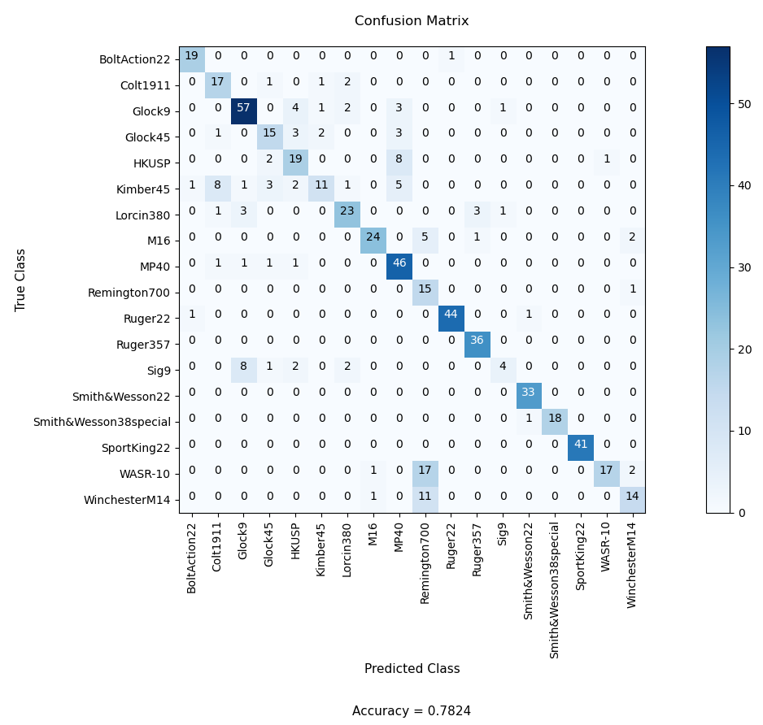
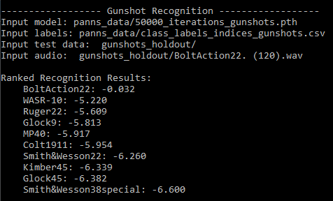

# Gun Model Recognition from Gunshot Audio

## Summary
This repository contains the training code I used to build a classifier which can take an audio recording of a gunshot and recognize the gun used among 18 different gun models.  Also included is the code that I used for recognition and accuracy scoring on holdout data, which consisted of 579 gunshot audio recordings.  My recognition accuracy on the holdout data was 78.2%, which I believe is the highest accuracy reported on this dataset. 

## Gunshot Dataset
For this project I used the publicly available Gunshot Audio Forensics Dataset.  This dataset was generated as part of an NIJ funded project and contains approximately 10,000 individual gunshot recordings from 18 different guns.  For variation in the dataset, the recordings were captured from twenty different distances/orientations and with three different recording devices.  For more information and to download the dataset, visit http://cadreforensics.com/audio/.
The tested guns are listed as:
1.	High Standard Sport King [.22LR, Pistol]
2.	S&W 34-1 [.22LR, Revolver]
3.	Ruger 10/22 [.22LR, Carbine]
4.	Remington 33 Bolt-Action Rifle [.22LR, Rifle]
5.	Lorcin L380 [.380 Auto, Pistol]
6.	S&W 10-8 [.38SPL, Revolver]
7.	Ruger Blackhawk [.357 MAG, Revolver]
8.	Glock 19 [9mm Luger, Pistol]
9.	Sig P225 [9mm Luger, Pistol]
10.	S&W M&P 40 [.40 S&W, Pistol]
11.	HK USP Compact [.40 S&W, Pistol]
12.	Glock 21 [.45 Auto, Pistol]
13.	Colt 1911 [.45 Auto, Pistol]
14.	Kimber Tactical Custom [.45 Auto, Pistol]
15.	Colt M16A1 AR15 [.223R/5.56, Rifle]
16.	Romarm WASR 10/63 AK47 [7.62x39mm, Carbine]
17.	Winchester M14 [.308W/7.62, Rifle]
18.	Remington 700 [.308W/7.62, Rifle]

## Method
Going in I recognized that this was an extremely challenging task as gunshots can sound very similar, especially from similar style and caliber guns.  From my research, it seemed that this kind of task was going to require a sophisticated approach if high accuracy was to be achieved. I took a deep learning approach where audio is converted into spectrogram images and used in the CNN architecture that has proven to be very good at recognizing images of faces, animals, handwriting, etc.  However, the problem was I didn’t have enough training data for such an approach to work well.  Therefore, I decided to find a pretrained model that was trained with a lot more audio data, even if the audio data didn’t consist of gunshot audio.  With such a pretrained model, I could use transfer learning and my gunshot audio dataset to train my final gunshot recognition model.
The pretrained model that I chose was based on the research paper "PANNs: Large-Scale Pretrained Audio Neural Networks for Audio Pattern Recognition."  The authors built the model with a 14-layer CNN architecture and from a very large public dataset called AudioSet, which is a collection obtained from over 2 million YouTube videos and contains 527 classes from categories that include human sounds, animal sounds, sounds of things, music, and sounds from nature.  For more information on AudioSet, see https://research.google.com/audioset/index.html.

## Results
I chose my holdout data by randomly removing about 10% of the audio files from each gun model folder in the dataset with a python script, which resulted in my holdout dataset being 579 audio files.  This holdout data was not used in the training of my model.
Here is a confusion matrix of my results.

 
As can be seen from the above, the results included three gun models having perfect recognition accuracy:  the Ruger 357, Smith & Wesson 22, and Sport King 22.  In examining the guns that were the most poorly recognized, we see that the misrecognitions were between guns with very similar style and caliber, which we expect to be the most confusable.
Looking at the results as a whole, we see that the vast majority of the guns were recognized well, resulting in an overall accuracy score of 0.7824.

## Conclussions
Given the difficulty of the task, I am very pleased with my accuracy of 78.2%.  Most other work with gunshots has focused on easier tasks, like recognizing gunshots just by category (rifle, pistol, or revolver) or by caliber.  As far I could find, no one has reported as high of an accuracy score for gun model recognition on the same dataset.  
The company that created the Gunshots Audio Forensics Dataset conducted their own gunshot model recognition work using the same dataset, and reported an average accuracy of 42%.  Broken down by subset, they reported an accuracy of 53% for the revolvers in the dataset, 25% for pistols in the dataset, and 48% for rifles in the dataset.  See https://www.ncjrs.gov/pdffiles1/nij/grants/252947.pdf.

## Installation (Windows or Linux)
1.	Make sure you have Anaconda installed on your computer.
2.	Create environment:
a.	If installing on Windows, type command:  conda env create -f environment_Windows.yml
b.	If installing on Linux, type command:  conda env create -f environment_Linux.yml
3.	For Windows only, type:  pip install -U soundfile
4.	For Linux only, type:   conda install nwani::portaudio nwani::pyaudio

## Training
1.	Download the Gunshot Audio Forensics Dataset from http://cadreforensics.com/audio/ and prepare as follows:
a.	Populate the 18 gun model folders in gunshots_recognition/gunshots_training with the corresponding audio files from the Gunshot Audio Forensics Dataset.
b.	Rename the audio files within each folder to prepend the gun model name to the audio file name.  In Windows this can easily be done by selecting all of the files in a directory, right-clicking, choosing ‘rename’, and typing in the gun model name at the beginning.  This will result in filename similar to ‘BoltAction22. (18).wav’ in the BoltAction22 directory.
c.	Move any files you wish to hold out of training and use for evaluation into the  gunshots_recognition/gunshots_holdout directory.  For a listing of the files that I used, see holdout_data_readme.txt.
2.	Open the Anaconda Prompt window.
3.	Activate the 'gunshots' environment:  conda activate gunshots
4.	Change directory to the gunshots_recognition directory.
5.	Type:  python utils/features.py pack_audio_files_to_hdf5 --dataset_dir=gunshots_training --workspace="/"
6.	Type:  python pytorch/main.py train --dataset_dir=gunshots_training --workspace="/" --holdout_fold=1 --model_type="Transfer_Cnn14" --pretrained_checkpoint_path="panns_data/Cnn14_mAP=0.431.pth" --loss_type=clip_nll --augmentation=mixup --learning_rate=1e-4 --batch_size=8 --resume_iteration=0 --stop_iteration=50000 --cuda

## Recognition and Accuracy Scoring
1.	Place the audio recordings you want to recognize into the gunshots_recognition/gunshots_holdout folder.
2.	Open the Anaconda Prompt window.
3.	Activate the 'gunshots' environment:  conda activate gunshots
4.	Change directory to the gunshots_recognition directory.
5.	Type:  python recognize.py
6.	After all holdout data has been recognized, a confusion matrix will be generated and displayed along with the overall accuracy score.  While running, you’ll see output such as this:

## General Tutorial to Train Different Data
1. Clone Repository
2. Get audio data you would like to use (only tested so far with .waves files)
3. Make your data in folders for each new specific sound, make sure in these folders the .waves are named with folder name THEN A "." (Ex: Fridge.0.wave)
4. Put this data in dataset_root (Ex: in dataset_root have a Fridge folder with Fridge.0.wave and Fridge.1.wave inside and another folder named Microwave with Microwave.0.wave etc.)
5. Change labels to match folder names for each sound in step 3 in utils-->config.py
6. Consider holding out some sound files from training to test. 
7. In the features folder delete any files in there so that it is empty. (May already be empty, but if there are any .h5 files delete them)
8. Use the specific commands given above.
9. After you do the "python utils/features.py pack_audio_files_to_hdf5 --dataset_dir=%DATASET_DIR%  -workspace=%WORKSPACE%" make sure that you now
have a waveform.h5 file in your 'features' folder. Once you have this you can actually train your data.
10. To train the data use the last command in the README_WINDOWS.txt which is "python pytorch/main.py train --dataset_dir=%DATASET_DIR% --workspace=%WORKSPACE% --holdout_fold=1 --model_type="Transfer_Cnn14" --pretrained_checkpoint_path=%PRETRAINED_CHECKPOINT_PATH% --loss_type=clip_nll --augmentation=mixup --learning_rate=1e-4 --batch_size=4 --resume_iteration=0 --stop_iteration=1000 --cuda"
11. You can change how many iterations, I used 50,000 for accurate results which took about a day to train with an RTX 2060. You can also change the batch size. 
12. Now you will have created an actual model to use in your demo. This model be in pytorch->main->holdout_folder=1->Transfer_Cnn14->pertrain=True->loss_type=clip_nll->augmentation=mixup->batch_size=(Whatever value you used, I used 4)->freeze_base=False->And find the .pth with the iteration value you chose.

## Citations
[1] Kong, Qiuqiang, Yin Cao, Turab Iqbal, Yuxuan Wang, Wenwu Wang, and Mark D. Plumbley. "PANNs: Large-Scale Pretrained Audio Neural Networks for Audio Pattern Recognition." arXiv preprint arXiv:1912.10211 (2019).